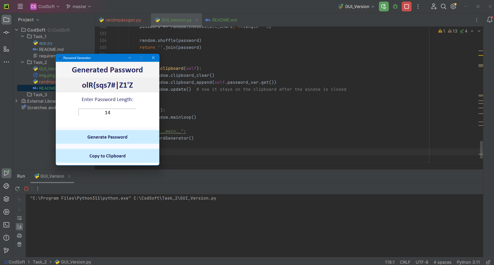

# Password Generator GUI

This project is a Password Generator GUI application created as part of an internship at CodSoft Batch 46. The application allows users to generate a secure password by specifying the desired length. The generated password includes a mix of letters, digits, and punctuation marks.

## Features

- **User-friendly GUI**: Easy-to-use graphical user interface built with `tkinter`.
- **Customizable Length**: Users can specify the desired length of the password.
- **Secure Passwords**: Ensures the generated password includes at least one letter, one digit, and one punctuation mark.

## Prerequisites

- Python 3.x
- `tkinter` (usually comes pre-installed with Python)

## Installation

1. **Clone the Repository**:

   ```bash
   git clone https://github.com/yourusername/password-generator-gui.git
   ```

2. **Navigate to the Project Directory**:

   ```bash
   cd password-generator-gui
   ```

## Usage

1. **Run the Application**:

   ```bash
   python password_generator_gui.py
   ```

2. **Generate a Password**:
   - Enter the desired password length in the input field.
   - Click the "Generate Password" button.
   - The generated password will be displayed in the output field.

## Code Overview

### `password_generator_gui.py`

This is the main script for the Password Generator GUI application.

- **Imports**:
  - `string` and `random` for generating the password.
  - `tkinter` for the GUI components.
  - `messagebox` for displaying error messages.

- **Functions**:
  - `generate_password(length)`: Generates a secure password of the specified length.
  - `on_generate_password()`: Handles the button click event to generate and display the password.

- **GUI Setup**:
  - Creates the main application window.
  - Adds input fields, labels, and buttons.
  - Runs the application loop.

## Example

Here's a screenshot of the Password Generator GUI:



## Contribution

Contributions are welcome! If you have any suggestions or improvements, please create a pull request or open an issue.

## License

This project is licensed under the MIT License. See the [LICENSE](LICENSE) file for more details.

## Contact

For any inquiries or feedback, please contact:

- Name: Manjunath Irukulla
- Email: imanjunad.com
